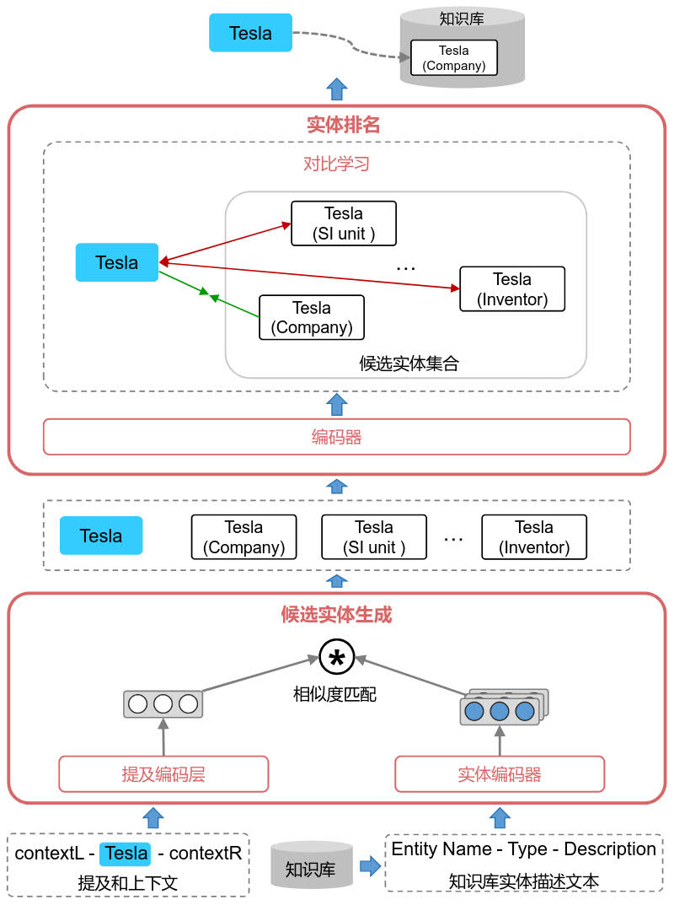

## Conf-EL

### Overview

Conf-EL（**Con**trastive Learning Based **F**ew-Shot **E**ntity **L**inking, Conf-EL）：



### Requirements

```bash
conda activate -n sparse python=3.9
conda activate sparse
pip install -r requirements.txt
```

### Datasets

EL: few-shot ZESHEL

Download the few-shot entity linking dataset [here](https://drive.google.com/drive/folders/1qL-_dN5Vyfkqp-arZm7hE8FB-IkdjpE8 ) and put the it under the `./zeshel` folder.

### Run

```
python run_model_keyword.py \
--model retriever_model/keyword_model.pt \
--pretrained_model google/electra-base-discriminator/ \
--data zeshel/data/[forgotten_realms.json | lego.json | yugioh.json | star_trek.json] \
--kb zeshel/kb/[forgotten_realms.json | lego.json | yugioh.json | star_trek.json]
```

